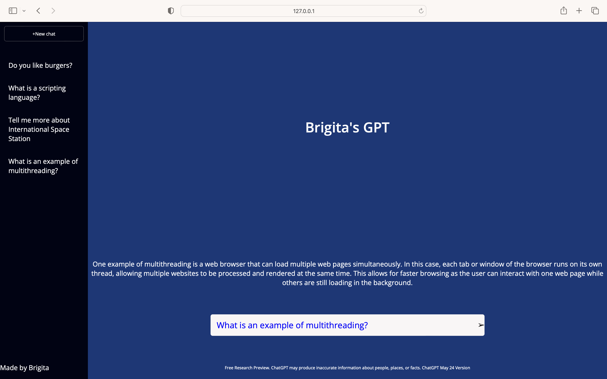

# ChatGPT Clone with Javascript

This is a ChatGPT clone created by JavaScript, HTML, and CSS. It has been inspired by Ania's YouTube tutorial: [Build ChatGPT in JavaScript](https://www.youtube.com/watch?v=05ssqx-SZT0&t=2179s).

## Description

This project is a ChatGPT clone that allows users to have interactive conversations with an AI-powered language model. It provides a user interface where users can input messages, and the AI model generates responses based on the input. The clone utilizes JavaScript for the logic, HTML for the structure, and CSS for the styling.

### Demo

## Features

- Interactive chat interface.
- Real-time conversation with the AI model.
- Support for multiple user messages and AI-generated responses.
- Option to switch between light and dark mode.

## Installation

1. Clone the repository: \`git clone git@github.com:brigitabi/ChatGPTCloneInJS.git\`
2. Open the project folder: \`cd chatgpt-clone\`
3. Launch the application: Open \`index.html\` in a web browser by using your own API keys. You can create your secret keys [here](https://platform.openai.com/account/api-keys).

## Usage

1. Enter a message in the input field and press Enter or click the Submit button.
2. The AI model will generate a response based on the input message.
3. The conversation history will be displayed in the chat area.

## Technologies Used

- JavaScript
- HTML
- CSS

## Credits

- [OpenAI](https://openai.com) - The language model used in this project is based on GPT-3.5 Turbo.

